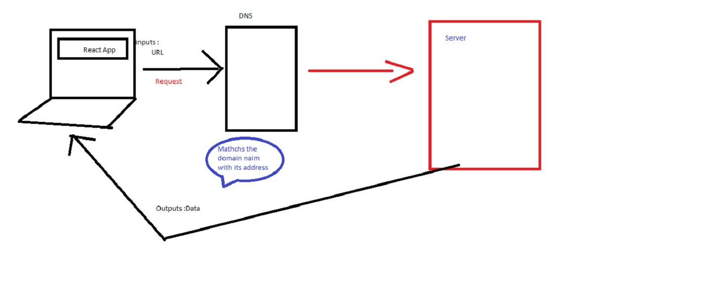
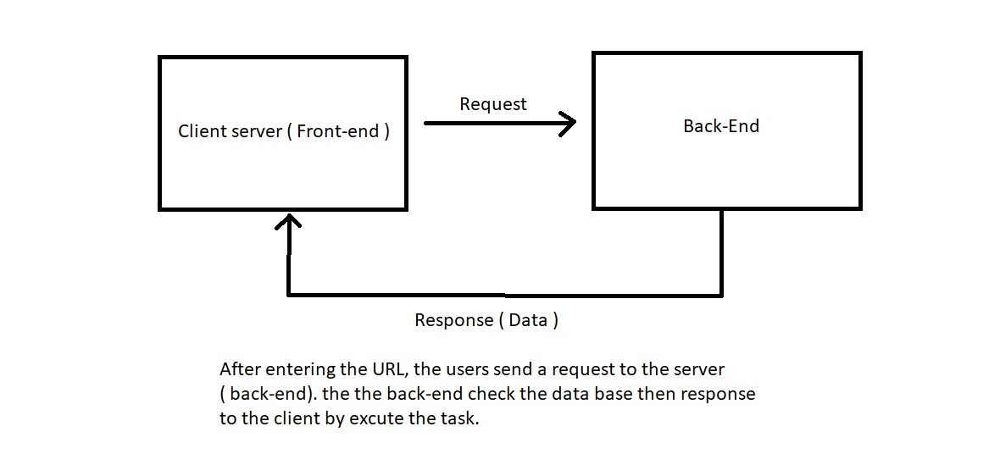
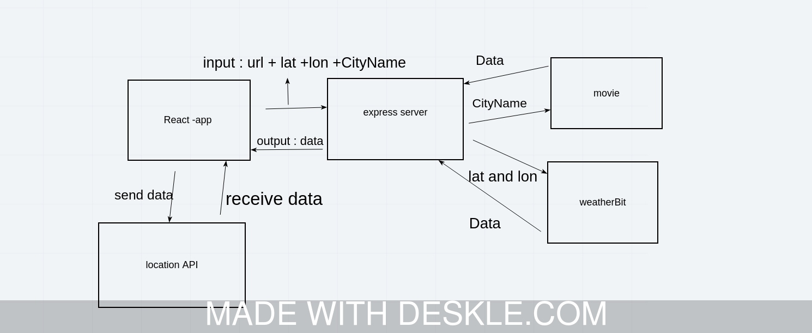

# city-explorer

**Author**: Mohammad jaradat
**Version**: 1.0.0 (increment the patch/fix version number if you make more commits past your first submission)

## Overview
<!-- Provide a high level overview of what this application is and why you are building it, beyond the fact that it's an assignment for this class. (i.e. What's your problem domain?) -->

- This web application view informatiopn about cities like location , map ,the weather and movie.

## Getting Started
<!-- What are the steps that a user must take in order to build this app on their own machine and get it running? -->
- Just Input City Name  in the Form then Exploer! button .

## Architecture
<!-- Provide a detailed description of the application design. What technologies (languages, libraries, etc) you're using, and any other relevant design information. -->
- I use javascript language and  React libariy with  bootstrap for bliud and design the website and some CSS .

## Change Log

<!-- Use this area to document the iterative changes made to your application as each feature is successfully implemented. Use time stamps. Here's an example:

01-01-2001 4:59pm - Application now has a fully-functional express server, with a GET route for the location resource. -->

- 06-05-2021 7:00pm - Application now has a fully-functional express server.

## Credit and Collaborations
<!-- Give credit (and a link) to other people or resources that helped you build this application. -->
- Thanks For :

1. Thanks for [weatherbit](https://www.weatherbit.io/) to provide data about weather
2. Thanks for [The Movie Database](https://www.themoviedb.org/) to provide data about movies

## lab 06

Name of feature: ______________ Asynchronous code, and APIs __________________

Estimate of time needed to complete: __2hours___

Start time: ___2 pm__

Finish time: ___5 pm__

Actual time needed to complete: ___3 hours__

## lab 07

Name of feature: ______________ Custom Servers with Node and Express __________________

Estimate of time needed to complete: __2hours___

Start time: ___2 pm__

Finish time: ___4 pm__

Actual time needed to complete: ___1.5 hours__

## lab 08

Name of feature: ______________ APIs __________________

Estimate of time needed to complete: __2hours___

Start time: ___2 pm__

Finish time: ___4 pm__

Actual time needed to complete: ___1.5 hours__

## lab 09

Name of feature: ______________ Refactoring into Modules __________________

Estimate of time needed to complete: __15min___

Start time: ___2 pm__

Finish time: ___2:30 pm__

Actual time needed to complete: ___30 min

